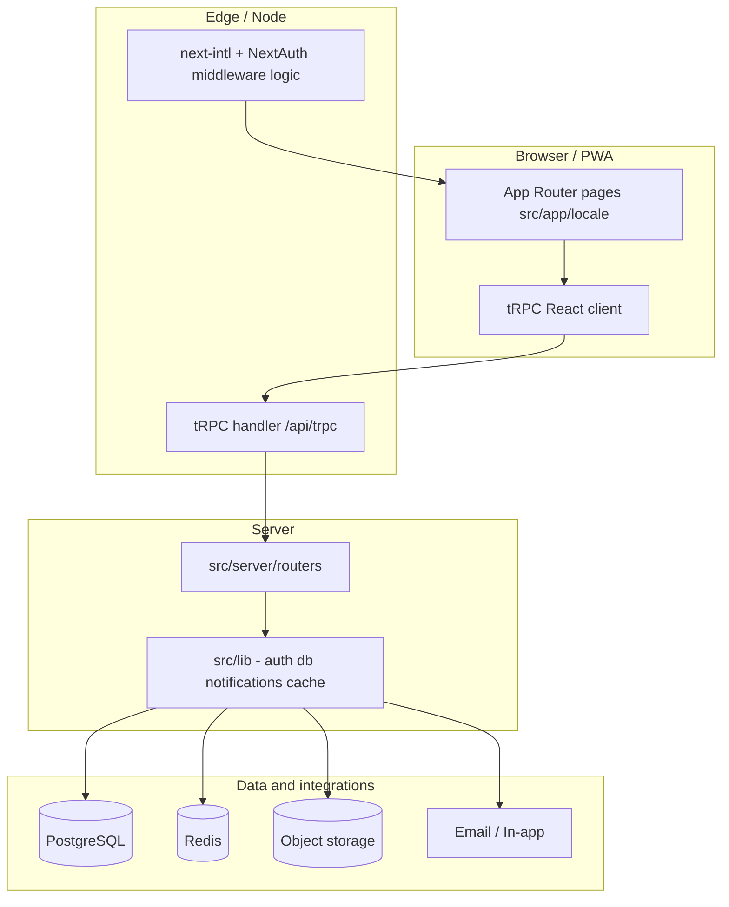

# Advanced guide — technical architecture (Wengz)

This document maps **stack choices**, **runtime boundaries**, and **important code paths** so engineers can navigate the repo without spelunking every folder. It complements `docs/ADVANCED_BUSINESS.md` (domain) and the focused i18n guides under `docs/`.

---

## Stack overview

| Layer               | Technology                                                                                                                                                                                                                                             |
| ------------------- | ------------------------------------------------------------------------------------------------------------------------------------------------------------------------------------------------------------------------------------------------------ |
| Framework           | **Next.js 16** (App Router); dev server uses **port 3001** (`npm run dev`)                                                                                                                                                                             |
| UI                  | **React 18**, **Tailwind CSS**, **Radix** primitives, **Framer Motion**, **Recharts**, **Swiper**                                                                                                                                                      |
| API                 | **tRPC v11** + **TanStack Query**; **SuperJSON** for serialization                                                                                                                                                                                     |
| Auth                | **NextAuth v4** (JWT sessions, **Credentials** provider), passwords via **bcrypt** (min 8 via shared `passwordSchema`); forgot/reset via hashed `PasswordResetToken` (1h, single-use) + email; `passwordChangedAt` invalidates JWTs after change/reset |
| Data                | **PostgreSQL** via **Prisma** (`prisma/schema.prisma`)                                                                                                                                                                                                 |
| i18n                | **next-intl** — locales `en`, `ar`; routing in `src/i18n/routing.ts`; messages in `messages/*.json`                                                                                                                                                    |
| Validation          | **Zod** (shared client/server shapes in `src/lib/validations.ts` and routers)                                                                                                                                                                          |
| Realtime / cache    | **Redis** (standard or **Upstash** — see `src/lib/cache.ts`)                                                                                                                                                                                           |
| File storage        | **AWS S3** / **Backblaze B2** (image domains allowed in `next.config.js`)                                                                                                                                                                              |
| PWA                 | **next-pwa** (disabled in development; see `next.config.js`)                                                                                                                                                                                           |
| Testing             | **Jest** + Testing Library; **Playwright** for E2E                                                                                                                                                                                                     |
| Docs / API explorer | **OpenAPI** surface (`trpc-to-openapi`, Swagger UI routes under `src/app/api/docs/`)                                                                                                                                                                   |

---

## High-level architecture

---

## Repository layout (practical map)

| Path                                         | Role                                                                                                                                                                                                    |
| -------------------------------------------- | ------------------------------------------------------------------------------------------------------------------------------------------------------------------------------------------------------- |
| `src/app/`                                   | App Router: `layout.tsx`, `globals.css`, `api/**` route handlers                                                                                                                                        |
| `src/app/[locale]/`                          | Locale segment; dashboard groups `(auth)`, `(dashboard)` with `client/`, `provider/`, `admin/`                                                                                                          |
| `src/server/trpc.ts`                         | tRPC initialization, **context** (`db`, `session`, `locale`, `req`), **procedures** (`public`, `protected`, `admin` / super-admin, `requestManager`, `financeManager`, `staff`, provider/client guards) |
| `src/server/routers/`                        | Domain routers composed in `_app.ts` → `AppRouter`                                                                                                                                                      |
| `src/lib/db.ts`                              | Prisma client singleton                                                                                                                                                                                 |
| `src/lib/auth.ts`                            | `authOptions` for NextAuth                                                                                                                                                                              |
| `src/lib/trpc/client.ts`                     | `createTRPCReact<AppRouter>()`                                                                                                                                                                          |
| `src/components/providers/trpc-provider.tsx` | React Query + tRPC provider wiring                                                                                                                                                                      |
| `src/lib/error-handler.ts`                   | Sonner toasts + tRPC/Zod message mapping; optional `next-intl` `t`                                                                                                                                      |
| `src/lib/notifications/`                     | Email, in-app, SSE helpers; **pass `locale`** from `ctx`                                                                                                                                                |
| `src/lib/provider-wallet.ts`                 | Provider earnings settlement (global USD credit price + commission), 7-day earnings hold (`held*` / ledger `HOLD` + `availableAt`), withdrawal holds, and manual payout recording                       |
| `src/lib/finance-settings.ts`                | Loads global `credit_price_usd` and `provider_commission_percent` from `SystemSettings`                                                                                                                 |
| `src/proxy.ts`                               | **Middleware implementation**: `next-intl` + `withAuth`, locale rewrite, **role-based redirects** for `client` / `provider` / `admin` segments (`export const config.matcher`)                          |

> **Note:** Next.js convention expects middleware at `middleware.ts` (project root or `src/`). This repository implements the same behavior in `src/proxy.ts`; ensure your deployment pipeline renames or re-exports it if your toolchain requires `middleware.ts`.

---

## Request path: tRPC

1. Client calls `trpc.*` hooks from `@/lib/trpc/client` (typed by `AppRouter`).
2. HTTP hits `src/app/api/trpc/[trpc]/route.ts` → `fetchRequestHandler` with `createTRPCContext`.
3. Context resolves **session** (NextAuth) and **locale** from cookies (`getLocaleFromCookie` in `src/server/trpc.ts`).
4. Routers use **Zod** inputs and throw **`TRPCError`**; `errorFormatter` attaches flattened **Zod** details for the client (`src/server/trpc.ts`).

---

## Passwords and session invalidation

| Concern         | Implementation                                                                                                                                                                                                                                                                                                 |
| --------------- | -------------------------------------------------------------------------------------------------------------------------------------------------------------------------------------------------------------------------------------------------------------------------------------------------------------- |
| Policy          | Shared `passwordSchema` in `src/lib/validations.ts` — trim, **min 8 / max 128**. Used by register, creator apply, reset, profile change (`user.changePassword`), admin create user. Login accepts any non-empty password (legacy accounts).                                                                    |
| Hashing         | `bcrypt` cost **12** everywhere passwords are written.                                                                                                                                                                                                                                                         |
| Forgot / reset  | `src/lib/password-reset.ts` + `src/lib/issue-password-reset.ts`. Raw token emailed; **SHA-256** stored. **1h TTL**, single-use, prior unused tokens invalidated. Requires `NEXTAUTH_URL` or `NEXT_PUBLIC_APP_URL`. SMTP failure revokes unused tokens and logs; public forgot response stays enumeration-safe. |
| Reset rules     | New password must differ from current; token consume + password write + session wipe happen in one transaction (`finalizePasswordReset`).                                                                                                                                                                      |
| Change password | Profile Security → `user.changePassword` only (no duplicate `auth.changePassword`). User is signed out afterward.                                                                                                                                                                                              |
| Admin support   | `admin.sendPasswordResetLink` emails a reset link for a credentials user (fails loudly if SMTP is down).                                                                                                                                                                                                       |
| Session kill    | `User.passwordChangedAt` bumped on change/reset; JWT callback + `src/proxy.ts` `authorized` reject older tokens; DB `Session` rows deleted.                                                                                                                                                                    |
| Login hardening | Email lowercased/trimmed; dummy bcrypt compare when user/password missing (timing); rate limits on login / forgot / reset.                                                                                                                                                                                     |

---

## Internationalization

- **Routing**: `src/i18n/routing.ts` — use **`Link` / `redirect` / `useRouter` / `usePathname` from `@/i18n/routing`**, not raw `next/navigation`, for locale-aware URLs (`localePrefix: "as-needed"`).
- **Language switch**: Client prefers `POST /api/locale` (sets `NEXT_LOCALE`, returns JSON path) + `router.replace(..., { locale })`. GET `/api/locale` remains a no-JS fallback. Redirects must use **`resolvePublicRequestOrigin` / `publicRedirectUrl`** (`src/lib/request-origin.ts`) — never raw `new URL(path, req.url)` behind a reverse proxy (that yields `localhost` Location headers in production). Set `NEXT_PUBLIC_APP_URL` (and `NEXTAUTH_URL`) to the public HTTPS origin; proxy should forward `X-Forwarded-Host` / `X-Forwarded-Proto`.
- **Messages**: `messages/en.json`, `messages/ar.json`; loaded in `src/app/[locale]/layout.tsx` into `NextIntlClientProvider`.
- **RTL**: Locale layout sets `dir` for Arabic.
- **Server copy**: Notification helpers under `src/lib/notifications/` accept **`locale`**; tRPC **`ctx.locale`** (`src/server/trpc.ts`) should be passed through for parity with UI language.

---

## Background and scheduled work

- **`src/app/api/cron/check-subscriptions/route.ts`**: Intended to be triggered by an external scheduler (GitHub Actions, system cron, etc.); scans subscriptions for expiry notifications and related updates. Secure this route in production (secret header, IP allowlist, or platform-only invocation).
- **`src/app/api/cron/check-delivered-approvals/route.ts`**: Suggested every **~15 minutes**. For `DELIVERED` requests: sends a client approval reminder after **1 hour** (`approvalReminderSentAt`), and sets `needsManualApproval` after **12 hours**. Auth uses `Authorization: Bearer ${CRON_SECRET}` (same pattern as subscription cron).
- **`src/app/api/cron/release-provider-holds/route.ts`**: Suggested every **~1 hour**. Releases `ProviderFinanceLedger` rows in `HOLD` whose `availableAt` has passed into wallet **available** balance (`held*` → `balance*`). Auth uses `Authorization: Bearer ${CRON_SECRET}`.

### Activity / audit log

- **`ActivityLog`** (`prisma/schema.prisma`) — immutable rows: actor, role, action, entity, message, metadata, level, timestamp.
- **Writers**: `src/lib/activity-log.ts` (`logActivity` / `logActivityAsync`) and request-scoped `src/lib/request-activity.ts` (`logRequestActivity`).
- **Request coverage**: create, claim, assign, unassign, accept, start, status/deliver, revision, approve, message (metadata only — no full chat body), rate, delete, restore. Delivered-approval cron writes one summary row (`cron.deliveredApprovals`), not per-request spam.
- **Admin UI**: `/admin/activity` via `admin.getActivityLogs` (filter by action prefix e.g. `request.`, level, or request `entityId`).

---

## Caching and performance

- `src/lib/cache.ts` — Redis (Upstash REST or traditional) with SuperJSON serialization; key taxonomy for users, services, packages, subscriptions, notifications.
- Hot reads use `getOrSetCached`: public packages, service types catalog, active subscription, unread notification counts. Mutations call helpers in `src/lib/cache-invalidation.ts`.
- `src/lib/session-user-cache.ts` — short-TTL cache around JWT session revalidation (memory + Redis) so batched tRPC pages do not hit the DB once per procedure.
- `src/lib/performance.ts` — wired as tRPC middleware on protected/admin/provider/client procedures.
- Pattern deletes use `SCAN` (not `KEYS`) for traditional Redis.
- Uploads are **local disk** via `src/app/api/upload/` (not S3 yet); `next.config.js` still allows remote image hosts for future object storage.
- Request/delivery attachments support up to **500MB** via chunked streaming (`/api/upload/init` → `/chunk` → `/complete`). Small files (≤20MB) still use single-shot `POST /api/upload`. Payment proofs stay capped at 10MB.
- Landing media: prefer compressed assets under `public/images/landing`; gallery videos lazy-load via IntersectionObserver.

---

## Quality gates (commands)

| Command              | Purpose                  |
| -------------------- | ------------------------ |
| `npm run lint`       | ESLint (Next)            |
| `npm run type-check` | `tsc --noEmit`           |
| `npm run test:ci`    | Jest in CI with coverage |
| `npm run test:e2e`   | Playwright               |

**Lint-staged** (on commit) runs ESLint, Prettier, and related Jest tests for touched files.

---

## Environment and secrets (non-exhaustive)

Typical categories inferred from code and dependencies:

- **Database**: `DATABASE_URL`, `DIRECT_URL` (Prisma)
- **Auth**: NextAuth `NEXTAUTH_SECRET`, `NEXTAUTH_URL`
- **Redis / Upstash**: as consumed in `src/lib/cache.ts`
- **Analytics**: `NEXT_PUBLIC_GTM_ID` (Google Tag Manager; omitted when unset — no hardcoded fallback)
- **Object storage (planned)**: AWS S3 / B2 SDKs may be present; current upload path is local filesystem

Treat this list as a **checklist**, not a complete `.env` template—verify each integration’s module for exact variable names.

---

## Role access (implementation pointers)

| Concern               | Location                                                                                                |
| --------------------- | ------------------------------------------------------------------------------------------------------- |
| Role enums + path ACL | `src/lib/roles.ts` (`canManageRequests`, `canManageFinance`, `canManagePlatform`, `canAccessAdminPath`) |
| Edge redirects        | `src/proxy.ts`                                                                                          |
| tRPC procedures       | `src/server/trpc.ts` (`adminProcedure`, `requestManagerProcedure`, `financeManagerProcedure`, …)        |
| Admin nav filter      | `src/app/[locale]/(dashboard)/dashboard-shell.tsx`                                                      |
| Domain rules          | `docs/ADVANCED_BUSINESS.md` (actors, capability matrix, known gaps)                                     |

`staffProcedure` exists in `src/server/trpc.ts` but is unused by routers; prefer the narrower request/finance procedures.

Maintenance mode login allows **any staff** (`isStaffRole` in `src/lib/auth.ts`), not super admin only.

---

## Related documents

- `docs/ADVANCED_BUSINESS.md` — domain and workflows
- `docs/WENGZ_KNOWLEDGE.md` — assistant/knowledge summary derived from business docs
- `src/lib/error-handler.ts` — Sonner toasts and `errors.*` message keys
- `src/lib/notifications/` — multi-channel notifications and locale parameters
- `.cursor/rules/nabra-core.mdc` — concise agent-oriented project summary
